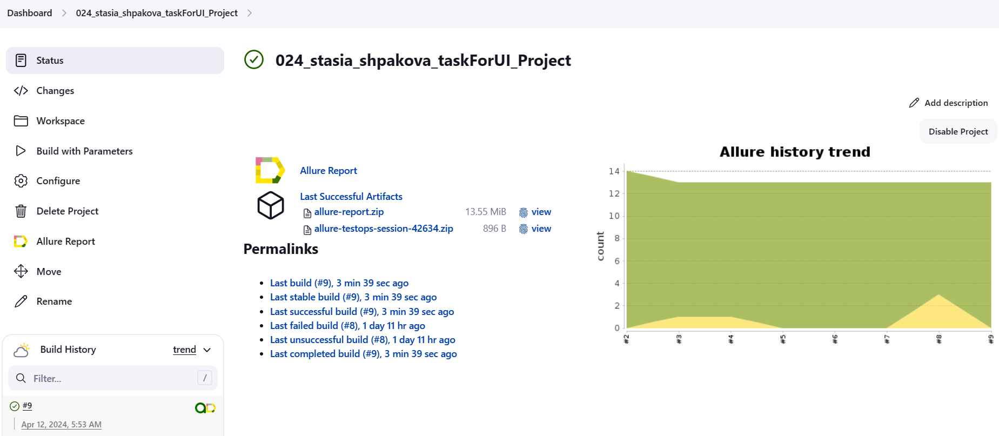
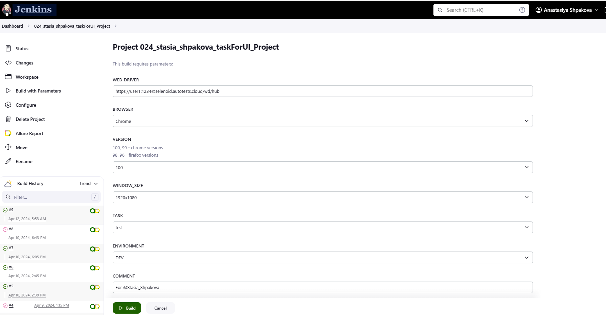
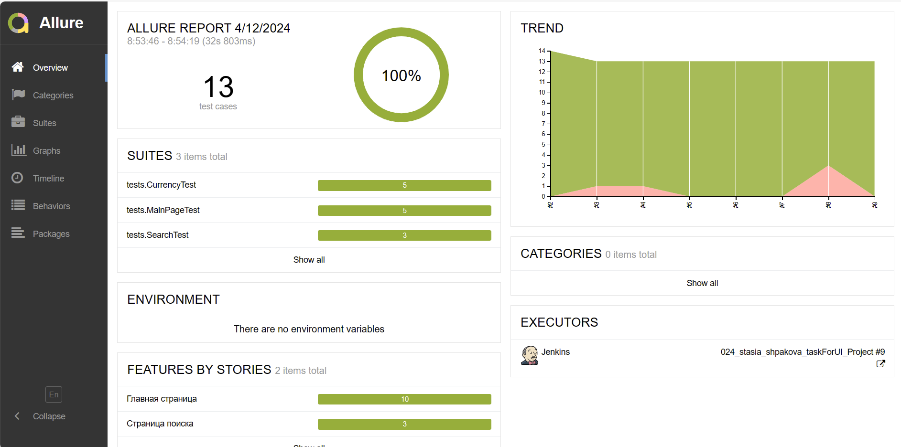
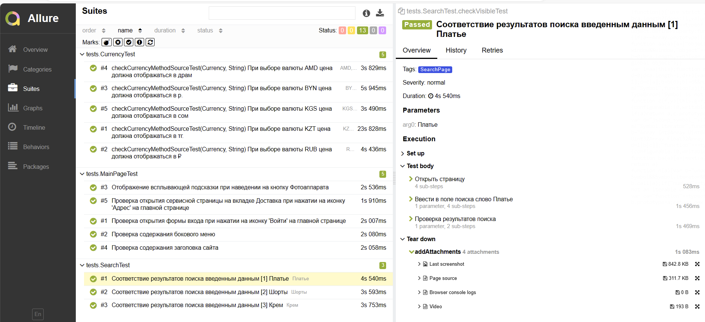
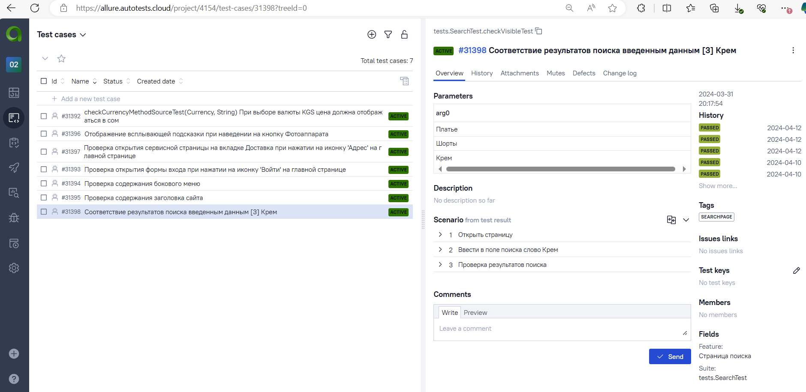
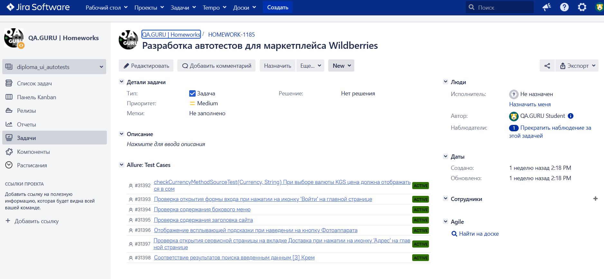
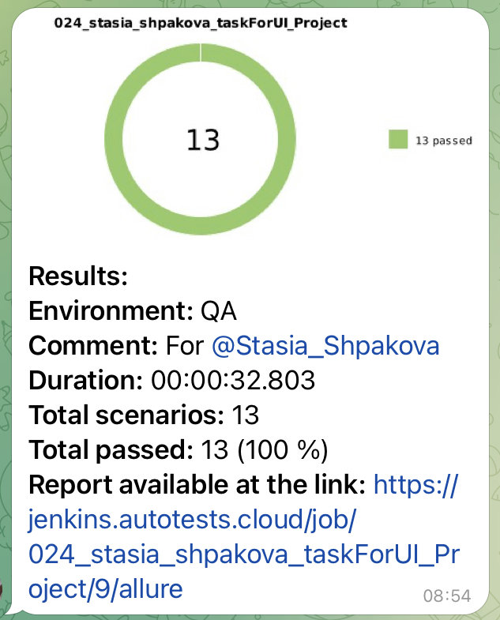

# Проект по автоматизации тестирования для маркетплейса «Wildberries»

## Технологии и инструменты

<p  align="center">

<a href="https://www.jetbrains.com/idea/"></a>
<a href="https://www.java.com/"></a>
<a href="https://selenide.org/"></a>
<a href="https://gradle.org/"></a>
<a href="https://junit.org/junit5/"></a>
<a href="https://selenoid.autotests.cloud/"></a>
<a href="https://github.com/"></a>
<a href="https://allurereport.org/"></a>
<a href="https://qameta.io/"></a>
<a href="https://www.jenkins.io/"></a>
<a href="https://www.atlassian.com/ru/software/jira"></a>
<a href="https://web.telegram.org/"></a>
</p>

### Автотесты написаны на <code>Java</code> с использованием <code>Selenide</code> для UI-тестов.

- Gradle — используется как инструмент автоматизации сборки.
- Jenkins — CI/CD для удаленного запуска тестов.
- Selenoid — для удаленного запуска браузеров в Docker-контейнерах.
- Allure TestOps - как система управления тестированием.
- Telegram Bot — для уведомлений о результатах прохождения тестов.
- Осуществлена интеграция с Allure TestOps и Jira.
- По итогу прохождения автотестов генерируется Allure отчет. Содержание отчета:
    - Шаги теста
    - Скриншот страницы на последнем шаге
    - Исходный код страницы в браузере
    - Логи консоли браузера
    - Видео выполнения автотеста

## Список проверок, реализованных в автотестах

- [x] Проверка содержания бокового меню
- [x] Отображение всплывающей подсказки при наведение на кнопку Фотоаппарата
- [x] Проверка содержания заголовка сайта
- [x] Для проверки отображения валюты применены параметризованные тесты
- [x] Соответствие результатов поиска введенным данным
- [x] Проверка открытия формы входа при нажатии на иконку 'Войти' на главной странице
- [x] Проверка открытия сервисной страницы на вкладке Доставка при нажатии на иконку 'Адрес' на главной странице

## Запуск тестов
### Локальный запуск тестов

Для запуска следует открыть IntelliJ IDEA и выполнить в терминале:
```
gradle clean test
```

или

```
gradle clean test -Denv=local
```

### Удаленный запуск тестов
Тесты можно запустить из терминала IntelliJ IDEA, а выполнены они будут в удаленно запущенном браузере в Docker-контейнере Selenoid:

```
gradle clean test -Denv=remote
```

Параметры, которыми можно управлять:
```
-DbrowserName - наименование браузера. По умолчанию chrome
-DbrowserVersion - номер версии браузера. По умолчанию 100.0
-DbrowserSize - размер окна браузера. По умолчанию 1980x1080
-DremoteUrl - адрес удаленного сервера, на котором будут запускаться тесты
```

### Сборка тестов в  <a target="_blank" href="https://jenkins.autotests.cloud/job/024_stasia_shpakova_taskForUI_Project/">Jenkins</a>

<p align="center">

</p>

>Для запуска сборки необходимо перейти в раздел `Build with Parameters` и нажать кнопку `Build`

<p align="center">

</p>

## Интеграция с <b><a target="_blank" href="https://jenkins.autotests.cloud/job/024_stasia_shpakova_taskForUI_Project/2/allure/">Allure report</a></b>
#### Результаты прохождения тестов
`ALLURE REPORT` - отображает дату и время прохождения тестов, общее количество запущенных тестов, а также процент и количество успешных и упавших тестов <br/>
`TREND` - отображает тенденцию выполнения тестов для всех запусков <br/>
`SUITES` - отображает распределение тестов по сьютам <br/>



#### Развернутый результат прохождения тестов:
1. Общий список автотестов
2. Содержание автотеста
3. Вложения



## Интеграция с <b><a target="_blank" href="https://allure.autotests.cloud/project/4154/test-cases/31398?treeId=0">Allure TestOps</a></b>

>


## Интеграция с <b><a target="_blank" href="https://jira.autotests.cloud/browse/HOMEWORK-11185">Jira</a></b>

>В Jira создана задача и в разделе `Allure:Test Cases` отображаются интегрированные автоматизированные тесты
>


## Уведомления в Telegram с использованием бота

> Бот, созданный в Telegram, после завершения сборки отправляет сообщение с отчетом о прохождении тестов
>

